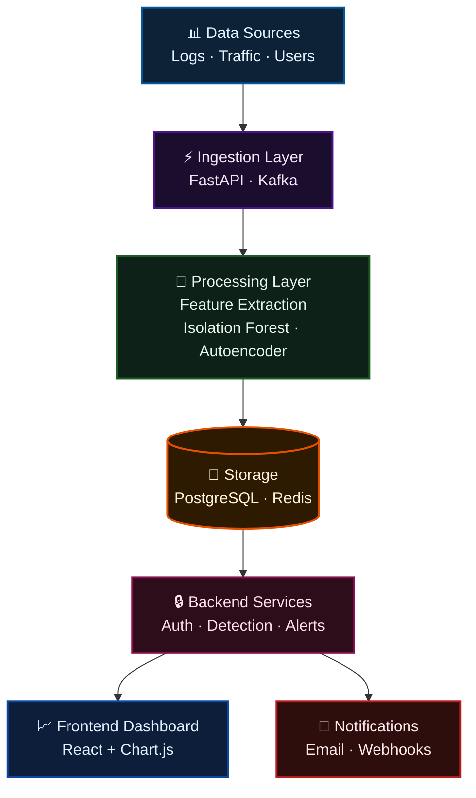

<div align="center">

<!-- Animated wave header -->


<!-- Animated badges row -->
<p align="center">
  <a href="#"></a>
  <a href="#"></a>
  <a href="#"></a>
  <a href="#"></a>
  <a href="#"></a>
</p>

<!-- Status badges -->
<p align="center">
  
  
  
  
</p>

<br>

<!-- Main animated typing banner -->
<a href="#">
  
</a>

</div>

---

<!-- Glowing divider -->
<div align="center">
  
</div>

## 🎯 What if your logs could talk?


The **AI Cyber Defense Platform** ingests server logs, network traffic, and user activity, then uses **Isolation Forest** (machine learning) to spot anomalies — **even attacks never seen before**.

Every threat gets a **risk score (0–100)**. High-risk events trigger **instant alerts** via email or dashboard. All visualized on a stunning **live dashboard**.

### 🎯 Perfect for:
- 🔵 **SOC analysts** managing threat queues
- 🟢 **Security engineers** building detection pipelines
- 🟡 **DevSecOps teams** integrating security into CI/CD
- 🔴 **Portfolio projects** that impress employers

<br clear="right"/>

<!-- Animated divider -->


---

## 🏗️ Architecture



---

## ✨ Core Features

<div align="center">

| &nbsp; | Feature | Description |
|:---:|:---|:---|
| 🔍 | **Log Ingestion** | Upload CSV/JSON or stream logs in real time |
| 🧠 | **AI Threat Detection** | Isolation Forest & Autoencoder – catches zero-day anomalies |
| 📊 | **Risk Scoring** | Every threat scored 0 (safe) → 100 (critical) |
| 🚨 | **Smart Alerts** | Email + live dashboard notifications for high-risk events |
| 📈 | **Live Dashboard** | Risk trends, threat counts, system health – all animated |
| 🔐 | **Auth & Roles** | JWT-secured with Admin / Analyst role separation |

</div>

---

## 📸 Dashboard Preview

<div align="center">
  
  <br><br>
  
  <br>
  
</div>

> 💡 **Tip:** Replace the GIF above with a real screen recording of your running dashboard using [LiceCap](https://www.cockos.com/licecap/) or [Gyroflow](https://gyroflow.xyz/).

---

## 🚀 Quick Start (Docker – 1 minute!)

<div align="center">
  
</div>

```bash
# 1. Clone the repository
git clone https://github.com/LuthandoCandlovu/AI_Cyber_Platform.git
cd AI_Cyber_Platform

# 2. Launch everything (backend · frontend · PostgreSQL · Redis)
docker-compose up --build
```

<div align="center">

| Service | URL | Status |
|:---:|:---:|:---:|
| 🖥️ Frontend Dashboard | `http://localhost:3000` | [](http://localhost:3000) |
| 📚 API Docs (Swagger) | `http://localhost:8000/docs` | [](http://localhost:8000/docs) |

**First time?** → Register → Upload `sample_logs.json` → Click **"Run Threat Detection"** 🎮

</div>

---

## 🧪 Manual Setup (No Docker)

<details>
<summary><b>🐍 Backend (FastAPI) — click to expand</b></summary>

```bash
cd backend
python -m venv venv
source venv/bin/activate      # Windows: .\venv\Scripts\activate
pip install -r requirements.txt
uvicorn app.main:app --reload
```
</details>

<details>
<summary><b>⚛️ Frontend (React) — click to expand</b></summary>

```bash
cd frontend
npm install
npm start
```
</details>

---

## 🛠️ Tech Stack

<div align="center">


<br><br>

<!-- Animated tech bars -->
<table>
  <tr>
    <td><b>Backend</b></td>
    <td>FastAPI · Python 3.11 · Scikit-learn · SQLAlchemy · Redis · Kafka</td>
  </tr>
  <tr>
    <td><b>Frontend</b></td>
    <td>React 18 · Chart.js · Tailwind CSS · Axios</td>
  </tr>
  <tr>
    <td><b>AI / ML</b></td>
    <td>Isolation Forest · Autoencoder · Real-time anomaly scoring</td>
  </tr>
  <tr>
    <td><b>Infrastructure</b></td>
    <td>Docker · Docker Compose · PostgreSQL 15 · JWT Auth</td>
  </tr>
</table>

</div>

---

## 📁 Project Structure

```
AI_Cyber_Platform/
│
├── 📂 backend/
│   ├── 📂 app/
│   │   ├── 📂 api/           # REST endpoints
│   │   ├── 📄 models.py      # SQLAlchemy models
│   │   ├── 🧠 detection.py   # Isolation Forest logic
│   │   └── 🚨 alert.py       # Email / webhook alerts
│   └── 📄 requirements.txt
│
├── 📂 frontend/
│   ├── 📂 src/
│   │   ├── 📂 pages/         # Login · Dashboard · Logs · Threats · Alerts
│   │   └── 📂 services/      # API client
│   └── 📄 package.json
│
├── 🐳 docker-compose.yml
└── 📖 README.md
```

---

## 📊 Activity

<div align="center">
  
</div>

---

## 🤝 Contributing

<div align="center">
  
  <br>

  [](https://github.com/LuthandoCandlovu/AI_Cyber_Platform/pulls)

  Pull requests welcome! For major changes, please open an issue first to discuss what you'd like to change.

  <br>

  <!-- Contributor animation -->
  
</div>

---

## 📄 License

<div align="center">
  
  <br><br>
  This project is licensed under the <strong>MIT License</strong> — feel free to use it for your own projects!
</div>

---

## ⭐ Show Your Support

<div align="center">

  

  **If this project helped you, give it a ⭐ on GitHub — it means the world! 🌟**

  <br>

  [](https://github.com/LuthandoCandlovu/AI_Cyber_Platform/stargazers)
  [](https://github.com/LuthandoCandlovu/AI_Cyber_Platform/network)
  [](https://github.com/LuthandoCandlovu/AI_Cyber_Platform/watchers)

</div>

---

<div align="center">

  <!-- Snake animation — run the GitHub Action below to generate this -->
  

  <br>

  <sub><strong>Built with ❤️ and ☕ by Luthando Candlovu</strong></sub>
  <br>
  <a href="https://twitter.com/yourtwitter"></a>
  &nbsp;
  <a href="https://linkedin.com/in/yourprofile"></a>
  &nbsp;
  <a href="mailto:your@email.com"></a>

  <br><br>

  

  <br><br>

  <!-- Animated footer wave -->
  

</div>
