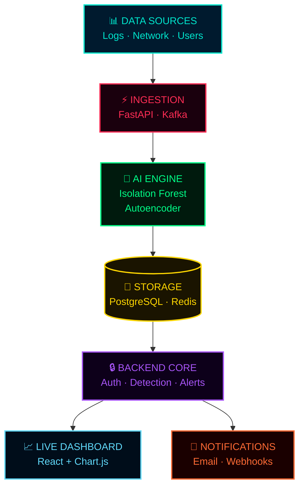

<!-- ============================================================
     AI CYBER DEFENSE PLATFORM — README.md
     by Luthando Candlovu
     ============================================================ -->

<!-- ░░░ HEADER ░░░ -->
<div align="center">

<!-- Top venom capsule — deep dark navy to teal -->


<br>

<!-- System online pulse line -->
<a href="https://github.com/LuthandoCandlovu/AI_Cyber_Platform">

</a>

<!-- Main headline -->
<a href="https://github.com/LuthandoCandlovu/AI_Cyber_Platform">

</a>

<!-- Live threat alert feed -->
<a href="https://github.com/LuthandoCandlovu/AI_Cyber_Platform">

</a>

<br>

<!-- Badge row 1 — tech stack -->
<p>
  
  
  
  
  
</p>

<!-- Badge row 2 — status -->
<p>
  
  
  
  
  
</p>

<!-- Visitor counter -->


</div>

<!-- ─── Animated scanner line ─── -->


---

## `> whoami` — What is This?


```terminal
$ ./cyber-platform --status

[✔] Log Ingestion ............. ACTIVE
[✔] Isolation Forest .......... LOADED
[✔] Autoencoder ............... LOADED
[✔] Risk Scoring Engine ....... RUNNING
[✔] Real-time Alerts .......... ENABLED
[✔] JWT Auth (Admin+Analyst) .. SECURED
[✔] Live Dashboard ............ LIVE

System Status: ██████████ 100% OPERATIONAL
```

The **AI Cyber Defense Platform** ingests server logs, network traffic, and user activity — then uses **Isolation Forest** and **Autoencoder** ML models to detect anomalies, **including attacks never seen before**.

Every event gets a **risk score (0–100)**. Threats above threshold trigger **instant email + dashboard alerts**. Everything streams to a **beautiful live dashboard** in real time.

<br clear="right"/>


---

## `> ls features/`

<div align="center">

```
┌─────────────────────────────────────────────────────────────────┐
│                    PLATFORM CAPABILITIES                        │
├──────────────────────┬──────────────────────────────────────────┤
│  🔍 Log Ingestion    │  Upload CSV/JSON or stream in real time  │
├──────────────────────┼──────────────────────────────────────────┤
│  🧠 AI Detection     │  Isolation Forest + Autoencoder models   │
├──────────────────────┼──────────────────────────────────────────┤
│  📊 Risk Scoring     │  Every event scored 0 (safe) → 100 (💀) │
├──────────────────────┼──────────────────────────────────────────┤
│  🚨 Smart Alerts     │  Email + dashboard — fires instantly     │
├──────────────────────┼──────────────────────────────────────────┤
│  📈 Live Dashboard   │  Risk trends · threats · health metrics  │
├──────────────────────┼──────────────────────────────────────────┤
│  🔐 Auth & Roles     │  JWT secured · Admin / Analyst roles     │
└──────────────────────┴──────────────────────────────────────────┘
```

</div>

---

## `> cat architecture.md`



---

## `> preview --dashboard`

<div align="center">


<br>


<br>
<sub>dashboard using <a href="https://www.cockos.com/licecap/">LiceCap</a></sub>

</div>

---

## `> docker-compose up --build`

<div align="center">

</div>

```bash
# ── Step 1: Clone ───────────────────────────────────────────────
git clone https://github.com/LuthandoCandlovu/AI_Cyber_Platform.git
cd AI_Cyber_Platform

# ── Step 2: Launch (backend · frontend · PostgreSQL · Redis) ────
docker-compose up --build

# ── Step 3: Open your browser ───────────────────────────────────
# 🖥️  Dashboard  →  http://localhost:3000
# 📚  API Docs   →  http://localhost:8000/docs
```

> **First time?** → Register → Upload `sample_logs.json` → Hit **"Run Threat Detection"** 🎮

<details>
<summary><code>> manual setup --no-docker</code></summary>

<br>

**🐍 Backend**
```bash
cd backend
python -m venv venv && source venv/bin/activate
pip install -r requirements.txt
uvicorn app.main:app --reload
```

**⚛️ Frontend**
```bash
cd frontend
npm install && npm start
```
</details>

---

## `> ls tech-stack/`

<div align="center">


<br><br>

| Layer | Technology |
|:---|:---|
| 🧠 **AI / ML** | Scikit-learn · Isolation Forest · Autoencoder |
| ⚡ **Backend** | FastAPI · Python 3.11 · SQLAlchemy · Kafka |
| ⚛️ **Frontend** | React 18 · Chart.js · Tailwind CSS · Axios |
| 💾 **Storage** | PostgreSQL 15 · Redis |
| 🔒 **Security** | JWT Auth · Role-based access control |
| 🐳 **Infra** | Docker · Docker Compose |

</div>

---

## `> tree .`

```
AI_Cyber_Platform/
│
├── 📂 backend/
│   └── 📂 app/
│       ├── 📂 api/          ← REST endpoints
│       ├── 📄 models.py     ← SQLAlchemy models
│       ├── 🧠 detection.py  ← Isolation Forest + scoring
│       └── 🚨 alert.py      ← Email / webhook dispatch
│
├── 📂 frontend/
│   └── 📂 src/
│       ├── 📂 pages/        ← Login · Dashboard · Logs · Threats · Alerts
│       └── 📂 services/     ← API client
│
├── 🐳 docker-compose.yml
└── 📖 README.md
```

---

## `> git log --graph`

<div align="center">
  
</div>

---

## `> git request-pull`

<div align="center">


[](https://github.com/LuthandoCandlovu/AI_Cyber_Platform/pulls)

Pull requests welcome — for major changes, open an issue first.

<br>


</div>

---

## `> star --this-repo`

<div align="center">


**If this helped you, drop a ⭐ — it keeps the engine running 🚀**

<br>

[](https://github.com/LuthandoCandlovu/AI_Cyber_Platform/stargazers)
[](https://github.com/LuthandoCandlovu/AI_Cyber_Platform/network)
[](https://github.com/LuthandoCandlovu/AI_Cyber_Platform/watchers)
[](./LICENSE)

</div>

---

<!-- Snake contribution grid -->
<div align="center">
  
</div>

---

<!-- ─── FOOTER ─── -->
<div align="center">

<sub>
  Built with ❤️ and late nights by <strong>Luthando Candlovu</strong>
  <br><br>
  <a href="https://twitter.com/yourtwitter">
    
  </a>
  &nbsp;
  <a href="https://linkedin.com/in/yourprofile">
    
  </a>
  &nbsp;
  <a href="mailto:your@email.com">
    
  </a>
</sub>

<br><br>

<!-- Bottom wave -->


</div>
